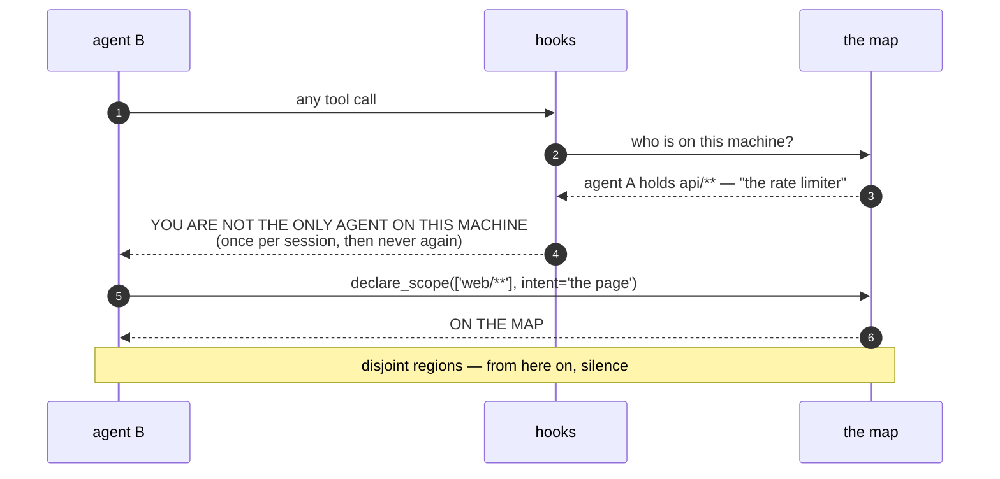
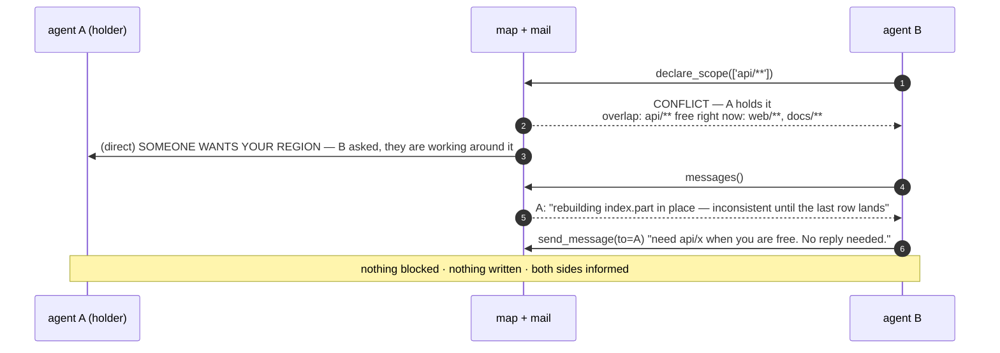
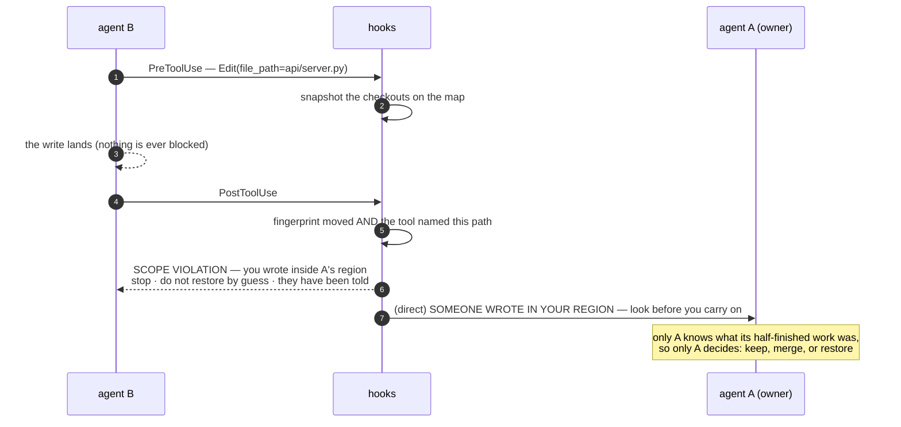
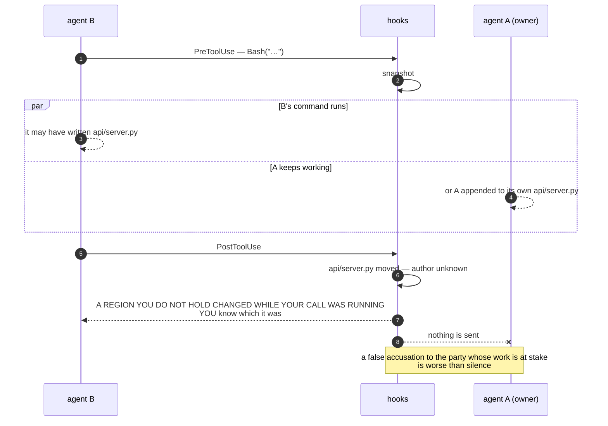
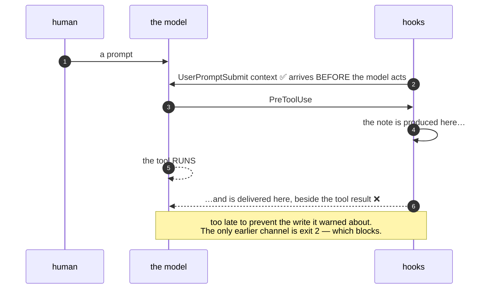
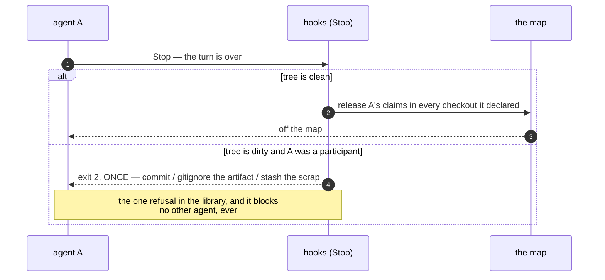

# What actually happens, in order

Sequence diagrams for every path an agent can take through the transponder. They are here because
the protocol's hard parts are all about *timing* — when a note can be delivered, and what is known
at the moment it is sent — and prose keeps making that sound simpler than it is.

`SPEC.md` is the normative document. This one is the pictures.

---

## 1. Walking in — the introduction, once

An agent cannot see other agents from inside its own context. That is the whole premise, and the
introduction is the fact it is missing.

The intro names the machine rather than "this checkout": an agent working across a library and its
client sits in neither and needs to know about both.

---

## 2. The region is taken — a conflict is an answer, not a wall

The conflicting claim is **not registered** — the map never double-books — but no call is refused
and B keeps working somewhere else.

---

## 3. A write the witness can attribute

`Edit`/`Write` carry the path they will write. The harness *declares* it, so there is an author.

---

## 4. A change the witness *cannot* attribute

A shell names nothing. The fingerprint proves the tree moved; it cannot prove who moved it — and
these two branches produce **the same picture from outside**.

If it *was* B, B knows, and B has a channel to say so. That is the cooperative bet, applied to the
one fact only one agent holds.

**This is why the alarm went quiet for shells.** Reported as certainty, it fired four times at an
agent whose only crime was a read loop long enough to span a neighbour's tick.

---

## 5. Why there is no warning *before* a write

The one that surprises everybody. A hook can reach an agent before its tool runs only by refusing
the call — and this library does not refuse.

So the pre-write warning was deleted rather than reworded. What genuinely arrives in time is
**pulled, not pushed**: `scopes()` and `declare_scope()` answer synchronously, in the agent's own
context, before it writes. Observed working — an agent asked, saw the holder, and declined to write.

---

## 6. Going home

Asked once and declined, the claims stay until the lease lapses: the work really is still there, and
the map should say so.

---

## Who is told what

| what happened | the actor is told | the region's owner is told |
|---|---|---|
| disjoint regions | nothing | nothing |
| walked into a shared machine | the introduction, once | — |
| asked for a held region | conflict + overlap + what is free | someone wants your region |
| **declared** write into another's region | SCOPE VIOLATION + remedy | someone wrote in your region |
| **shell** change in another's region | this changed while you ran | **nothing** |
| history moved underneath | drift note | — |
| said something on the channel | — | only if they call `messages()` |

The last row is the design in one line: **direct messages are pushed, the room is pulled.** Chat
traffic and the violation alarm share one delivery path, and an agent trained to skim the channel
skims the alarm with it.
